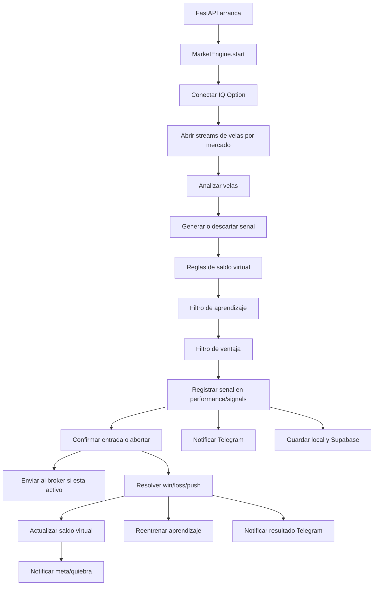

# Documentacion del sistema y guia para escalar el proyecto

Este documento explica el sistema actual de trading bot desde lo mas superficial hasta el nucleo tecnico. Esta pensado para incorporar un equipo nuevo, entender las reglas del negocio, identificar los puntos de riesgo de la version actual y tener claro que debe cambiar en el nuevo proyecto descrito en `PROMPT_NUEVO_PROYECTO_DESDE_CERO.md`.

No incluye credenciales reales. Cualquier correo, contrasena, token de Telegram o clave de Supabase debe vivir solo en `.env`, Render o el gestor seguro de secretos que use el equipo.

---

## 1. Que es este proyecto

El proyecto es una aplicacion web para monitorear velas reales de IQ Option, analizar mercados OTC de corto plazo, generar senales para opciones binarias y, opcionalmente, duplicar en el broker real las operaciones que el sistema aprueba dentro del saldo virtual.

En terminos simples:

1. Se conecta a IQ Option.
2. Lee velas reales del broker.
3. Analiza fuerza, continuidad, cansancio y CCI(20).
4. Decide si hay operacion CALL o PUT.
5. Registra la operacion en un historial virtual.
6. Evalua si la operacion gano, perdio, empato o fue abortada.
7. Aprende de resultados reales y sombras.
8. Notifica por Telegram.
9. Sincroniza estado con Supabase.
10. Si el broker real esta activado, intenta operar las mismas operaciones aprobadas por el saldo virtual.

La aplicacion no deberia usar TradingView, Twelve Data, Binance ni fuentes externas para las velas principales. La fuente principal es IQ Option mediante `iqoptionapi`.

---

## 2. Objetivo funcional

El objetivo no es generar muchas senales. El objetivo es generar pocas senales con mejor probabilidad, especialmente para expiraciones cortas:

- 30 segundos.
- 1 minuto.

La configuracion actual trabaja principalmente con timeframe de 60 segundos.

La meta de negocio es que el sistema:

- Aprenda de victorias, perdidas y senales bloqueadas.
- Mejore la seleccion de entradas.
- Evite repetir patrones perdedores.
- Mantenga historial persistente aunque Render reinicie.
- Permita comparar el rendimiento virtual con el broker real.

---

## 3. Stack actual

Backend:

- Python 3.12.8.
- FastAPI.
- Uvicorn.
- Pydantic Settings.
- `python-dotenv`.
- `python-telegram-bot`.
- `iqoptionapi` desde GitHub.
- `websocket-client==0.56.0`.

Frontend:

- HTML, CSS y JavaScript estatico.
- Canvas custom para dibujar velas.
- WebSocket para estado en vivo.
- Fetch REST como fallback.

Persistencia:

- JSON locales dentro de `DATA_DIR`.
- Supabase como espejo remoto de esos JSON.

Broker:

- IQ Option mediante `iqoptionapi.stable_api.IQ_Option`.

---

## 4. Estructura principal del codigo actual

Backend:

- `app/main.py`: crea FastAPI, endpoints HTTP, WebSocket y ciclo de vida del motor.
- `app/config.py`: lee variables de entorno.
- `app/market_engine.py`: motor central. Conecta broker, analiza mercados, registra senales, ejecuta broker, envia estado al frontend.
- `app/analysis.py`: estrategia tecnica de price action + CCI.
- `app/iq_option_broker.py`: adaptador de IQ Option.
- `app/broker_interface.py`: contrato comun del broker.
- `app/broker_trade_executor.py`: puente entre operaciones virtuales y ordenes al broker.
- `app/performance_tracker.py`: historial de operaciones, resultados y saldo virtual.
- `app/learning.py`: sistema de aprendizaje estadistico.
- `app/telegram_notifier.py`: notificaciones de senales, resultados, resumenes, metas y quiebras.
- `app/state_storage.py`: persistencia local y espejo Supabase.
- `app/models.py`: modelos Pydantic y dataclasses.

Frontend:

- `static/index.html`: estructura visual del dashboard.
- `static/css/styles.css`: estilos.
- `static/js/app.js`: WebSocket, renderizado, grafico, botones, paneles y sonido.

Pruebas:

- `tests/test_iq_option_broker.py`.
- `tests/test_broker_trade_executor.py`.
- `tests/test_market_engine_broker_sync.py`.
- `tests/test_performance_tracker.py`.
- `tests/test_signal_history.py`.
- `tests/test_state_storage.py`.
- `tests/test_telegram_notifier.py`.
- `tests/test_balance_rules.py`.

---

## 5. Variables de entorno principales

Credenciales:

- `IQ_OPTION_EMAIL`.
- `IQ_OPTION_PASSWORD`.
- `IQ_OPTION_2FA_CODE`.
- `TELEGRAM_BOT_TOKEN`.
- `TELEGRAM_CHAT_ID`.
- `SUPABASE_URL`.
- `SUPABASE_SERVICE_ROLE_KEY` o alternativas soportadas.

Mercados:

- `MARKETS`.
- `DISABLED_MARKETS`.
- `DEFAULT_TIMEFRAME`.
- `POLL_INTERVAL_SECONDS`.
- `CANDLE_COUNT`.

Aprendizaje:

- `LEARNING_ENABLED`.
- `LEARNING_UPDATE_ENABLED`.
- `LEARNING_MIN_HISTORY`.
- `LEARNING_MIN_WIN_RATE`.
- `LEARNING_MIN_RULE_SAMPLES`.
- `LEARNING_MIN_SIMILARITY_SAMPLES`.
- `LEARNING_EXPLORATION_INTERVAL`.

Filtro de ventaja:

- `ADVANTAGE_FILTER_ENABLED`.
- `ADVANTAGE_FILTER_MIN_WIN_RATE`.
- `ADVANTAGE_FILTER_MIN_SAMPLES`.
- `ADVANTAGE_FILTER_MIN_FACTOR_SCORE`.

Saldo virtual:

- `VIRTUAL_INITIAL_BALANCE`.
- `VIRTUAL_TARGET_BALANCE`.
- `VIRTUAL_CAUTIOUS_STAKE`.
- `VIRTUAL_SAFE_STAKE`.
- `VIRTUAL_PAYOUT_RATE`.

Broker:

- `BROKER_TRADING_ENABLED`.
- `BROKER_TRADE_ENTRY_WINDOW_SECONDS`.
- `IQ_OPTION_BALANCE_MODE`.

Supabase:

- `SUPABASE_STATE_ENABLED`.
- `SUPABASE_STATE_TABLE`.
- `SUPABASE_VERSIONS_TABLE`.
- `SUPABASE_BOOTSTRAP_LOCAL`.
- `SUPABASE_TIMEOUT_SECONDS`.
- `SUPABASE_REMOTE_SAVE_INTERVAL_SECONDS`.
- `SUPABASE_VERSIONING_ENABLED`.
- `SUPABASE_VERSION_INTERVAL_SECONDS`.

Observacion importante: la version actual tiene variables antiguas en `.env` que ya no son fuente principal, como `REMOTE_STATE_ENABLED` y `SUPABASE_STATE_BACKUP_TABLE`. El nuevo proyecto debe mapearlas solo por compatibilidad y emitir advertencias.

---

## 6. Flujo general del sistema actual



Este flujo funciona, pero hoy esta repartido entre varios archivos JSON y varias rutas de ejecucion. Esa es una de las causas principales de desfases.

---

## 7. Conexion con IQ Option

La conexion al broker se implementa en `app/iq_option_broker.py`.

El flujo basico es:

1. Importar `IQ_Option`.
2. Crear cliente con email y contrasena.
3. Ejecutar `client.connect()`.
4. Si IQ Option exige 2FA, intentar `client.connect_2fa(IQ_OPTION_2FA_CODE)`.
5. Cambiar balance a `PRACTICE` o `REAL`.
6. Actualizar tabla de activos si la libreria lo permite.
7. Leer velas historicas o realtime.
8. Comprar con `client.buy(...)`.

La libreria usada no es oficial. Esto implica:

- IQ Option puede cambiar endpoints.
- Algunos activos pueden tener nombres internos distintos.
- El stream puede retrasarse.
- `client.buy` puede tardar mas de lo esperado.
- Los errores del broker pueden venir como texto, no como codigos claros.

El adaptador actual normaliza algunos alias:

- `BTCUSD-OTC` puede mapear a `BTCUSD-OTC-op`.
- `BTC/USD-OTC` se normaliza.
- `NVDA/AMD-OTC` tiene aliases para NVIDIA/AMD.
- `USDJPY-OTC` tuvo muchos rechazos y esta deshabilitado por defecto.

---

## 8. Tecnica de trading usada

La tecnica esta basada en price action de corto plazo con CCI(20). No es un bot de tendencia larga.

Factores principales:

- CCI periodo 20.
- Sobrecompra: `+100`.
- Sobreventa: `-100`.
- Fuerza de velas.
- Continuidad.
- Cansancio.
- Rechazo.
- Mechas.
- Cuerpo de vela.
- Tendencia contextual.
- Si la vela actual mantiene presion o empieza a pelear contra el movimiento.

La idea operativa explicada por el usuario es:

- Cuando el mercado rompe maximos con CCI alto, puede venir retroceso.
- Cuando rompe minimos con CCI bajo, puede venir retroceso.
- Pero no se opera automaticamente contra el movimiento.
- Si la fuerza y continuidad siguen limpias, se puede operar a favor de la tendencia.
- Si la tendencia viene fuerte pero la vela actual muestra cansancio, lucha o rechazo, se puede operar retroceso.
- La decision entre continuacion y retroceso depende de fuerza, continuidad y cansancio.

---

## 9. Como analiza una vela

El analizador calcula metricas por vela:

- Direccion: alcista, bajista o doji.
- Tamano del cuerpo.
- Rango total.
- Proporcion cuerpo/rango.
- Mecha superior.
- Mecha inferior.
- Posicion del cierre dentro del rango.

Luego analiza:

- Ultimas velas cerradas.
- Vela en formacion cuando ya tiene suficiente progreso.
- CCI(20).
- Si CCI esta rompiendo extremos relevantes.
- Si hay continuidad de las ultimas 3 o 5 velas.
- Si hay fuerza limpia.
- Si hay cansancio.
- Si hay breakout de precio reciente.
- Si la tendencia contextual acompana o contradice.

La senal final puede ser:

- Continuacion: operar en la misma direccion de la presion.
- Retroceso: operar contra la presion si hay cansancio suficiente.
- Bloqueada/descartada: no operar.

---

## 10. Puntuacion y confianza

La senal tiene dos niveles de puntuacion:

- `score` de 1 a 10.
- `factor_score` de 0 a 6.

El `factor_score` actual suma factores como:

- CCI extremo.
- Ruptura de precio.
- Fuerza o cansancio suficiente.
- Continuidad.
- Tendencia/contexto.
- Confluencia.

La confianza se clasifica en:

- `high`: normalmente usa `VIRTUAL_SAFE_STAKE`.
- `low`: normalmente usa `VIRTUAL_CAUTIOUS_STAKE`.
- `discarded`: no opera.

Si la senal no alcanza los requisitos tecnicos, se registra como bloqueada o sombra, no como operacion real.

---

## 11. Saldo virtual

El saldo virtual vive en `PerformanceTracker`.

Valores por defecto:

- Saldo inicial: `50000`.
- Meta: `500000`.
- Apuesta cautelosa: `10000`.
- Apuesta segura: `20000`.
- Payout simulado: `0.85`.

Reglas principales:

1. Si gana:
   - Se suma `stake_amount * payout_rate`.
   - Se reinicia la racha de perdidas.
   - Aumenta la racha de victorias.

2. Si pierde:
   - Se resta `stake_amount`.
   - Aumenta `consecutive_losses`.
   - Se guarda la hora de la perdida.

3. Si empata:
   - No suma ni resta.
   - Se registra como push.

4. Si el saldo cae por debajo de `VIRTUAL_CAUTIOUS_STAKE`:
   - Se considera quiebra.
   - Se reinicia el saldo al inicial.
   - Se agrega evento `[QUIEBRA #N]`.
   - Se reinician rachas y contador desde reset.

5. Si el saldo llega o supera `VIRTUAL_TARGET_BALANCE`:
   - Se considera meta alcanzada.
   - Se reinicia el saldo al inicial.
   - Se agrega evento `[META #N]`.
   - Se activa una fase de consolidacion post-meta.

6. Si hay muchas quiebras o rachas malas:
   - Se exige mayor confianza.
   - Puede pausar entradas por varias velas.
   - Puede limitar apuestas a la cautelosa.

---

## 12. Que pasa cuando gana

Cuando una operacion termina en `win`:

1. Se compara la salida contra la entrada.
2. En CALL gana si `result_price > entry_price`.
3. En PUT gana si `result_price < entry_price`.
4. Se registra el resultado en `performance.json`.
5. Se recalcula saldo virtual.
6. Se suma ganancia simulada segun payout.
7. Se reinicia racha de perdidas.
8. El aprendizaje usa ese ejemplo para reforzar patrones similares.
9. Telegram puede enviar resultado ganado.
10. Si cada 5 operaciones hay resumen pendiente, Telegram envia resumen.
11. Si se alcanza meta, se notifica evento de meta.

---

## 13. Que pasa cuando pierde

Cuando una operacion termina en `loss`:

1. Se compara la salida contra la entrada.
2. En CALL pierde si `result_price < entry_price`.
3. En PUT pierde si `result_price > entry_price`.
4. Se resta el monto apostado al saldo virtual.
5. Aumenta la racha de perdidas.
6. El aprendizaje usa ese ejemplo para detectar patrones que debe evitar.
7. Si el saldo queda por debajo del minimo, se registra quiebra.
8. En escenarios de proteccion se exige mayor `factor_score`.
9. Telegram puede enviar resultado perdido.
10. Si aplica, Telegram envia quiebra.

La perdida no detiene el bot. El bot sigue operando, pero puede entrar en modo mas conservador.

---

## 14. Que pasa cuando se aborta

Una operacion puede pasar por estado `waiting_entry` antes de volverse `pending`.

En la apertura de la vela de entrada, el sistema revisa si la entrada sigue siendo valida. Si detecta que la vela inicial invalida la operacion, la marca como `aborted`.

Ejemplos de aborto:

- CCI cruza en sentido contrario.
- El empuje que debia cansarse sigue fuerte.
- La vela inicial contradice el setup.
- La operacion de retroceso pierde sentido.
- Aparece impulso contrario fuerte.

Regla ideal:

- Una operacion abortada no debe enviarse al broker.

Problema actual detectado:

- En los datos actuales existen operaciones `placed` en broker cuyo registro virtual termino como `aborted`. Esto indica que la version actual no garantiza de forma perfecta que la validacion de aborto ocurra antes de comprar.

El nuevo proyecto debe convertir esta regla en una transaccion dura:

```text
validar entrada -> si no aborta -> enviar broker -> registrar orden
```

Nunca:

```text
enviar broker -> despues descubrir que era abortada
```

---

## 15. Aprendizaje

El aprendizaje vive en `app/learning.py`.

La version actual reconstruye reglas desde operaciones resueltas en `performance.json`.

Usa ejemplos con estado:

- `win`.
- `loss`.

Incluye:

- Operaciones reales.
- Operaciones sombra.

Una operacion sombra es una senal que el sistema pudo haber operado, pero fue bloqueada por una regla tecnica, saldo, aprendizaje o filtro de ventaja. La sombra se registra para saber si bloquearla fue buena decision.

El aprendizaje genera reglas por:

- Mercado.
- Direccion.
- Timeframe.
- Score.
- Mercado + direccion.
- Direccion + score.
- Mercado + score.
- Mercado + direccion + score.
- CCI por direccion y banda.
- Fuerza por banda.
- Continuidad por banda.
- Cansancio por banda.
- Firma de metricas.
- Mercado + firma de metricas.

Cada regla acumula victorias y perdidas. Luego el sistema estima si una nueva senal parecida tiene suficiente probabilidad historica.

---

## 16. Como decide el aprendizaje

Flujo:

1. Si `LEARNING_ENABLED=false`, permite senales.
2. Si hay menos de `LEARNING_MIN_HISTORY` ejemplos, observa y permite.
3. Si ya hay historia suficiente, busca reglas similares.
4. Calcula tasa estimada de acierto.
5. Compara contra `LEARNING_MIN_WIN_RATE`.
6. Si una regla especifica rinde mal, bloquea.
7. Si casos similares rinden por debajo del minimo, bloquea.
8. Si la senal es fuerte y se cumple `LEARNING_EXPLORATION_INTERVAL`, puede permitir exploracion controlada.

El aprendizaje no cambia la tecnica base directamente. Actua como filtro estadistico sobre senales que la tecnica ya genero.

---

## 17. Filtro de ventaja

El filtro de ventaja es una segunda compuerta.

Aunque el aprendizaje permita una senal, el filtro de ventaja puede bloquearla si no cumple:

- Minimo acierto historico.
- Minimo muestras similares.
- Minimo `factor_score`.

Variables:

- `ADVANTAGE_FILTER_ENABLED`.
- `ADVANTAGE_FILTER_MIN_WIN_RATE`.
- `ADVANTAGE_FILTER_MIN_SAMPLES`.
- `ADVANTAGE_FILTER_MIN_FACTOR_SCORE`.

Este filtro fue creado para operar menos y con mas ventaja, pero puede reducir demasiado la frecuencia si se configura muy exigente.

---

## 18. Broker real

El broker real esta apagado por defecto:

```env
BROKER_TRADING_ENABLED=false
```

Cuando se activa:

1. El sistema verifica conexion a IQ Option.
2. El dashboard marca broker ON.
3. Las operaciones virtuales aprobadas deben duplicarse en IQ Option.
4. Los intentos se guardan en `broker_trades.json`.
5. El panel "Broker en vivo" muestra ordenes enviadas o fallidas.

Reglas actuales de ejecucion:

- No operar sombras.
- No operar direcciones invalidas.
- No operar si stake es menor al minimo.
- No operar si ya existe orden colocada para ese `signal_id`.
- No operar si el broker esta desconectado.
- No operar si la operacion virtual ya expiro.

Riesgo actual:

- El broker depende de rutas asincronas multiples.
- Algunas operaciones pueden llegar tarde.
- Algunas llamadas a IQ Option tardan mucho en confirmar.
- Los historiales pueden quedar desalineados.

---

## 19. Telegram

Telegram notifica:

- Senales.
- Resultados.
- Resumen cada 5 operaciones.
- Quiebras.
- Metas.
- Mensaje de prueba.

Actualmente guarda deduplicacion en `telegram_notifications.json`.

Problema de arquitectura:

- Telegram tiene su propio historial de IDs.
- Si `performance.json`, `signals.json` y `telegram_notifications.json` divergen, Telegram puede quedar desfasado.

Regla para el nuevo proyecto:

- Telegram no debe tener un historial paralelo.
- Debe ser una proyeccion de eventos canonicos.
- Debe deduplicar con constraints en base de datos, por ejemplo `(signal_id, message_type)`.

---

## 20. Supabase

La version actual usa Supabase como espejo remoto de JSON.

Filas principales en `bot_state_files`:

- `performance.json`.
- `learning.json`.
- `signals.json`.
- `telegram_notifications.json`.
- `broker_trades.json`.

Ventaja:

- Permite persistir estado aunque Render reinicie.
- Permite que el aprendizaje no empiece de cero.

Problema:

- Algunos JSON son muy grandes.
- Se reescriben objetos completos.
- Puede haber timeouts de lectura/escritura.
- Local y remoto pueden divergir.
- No hay transacciones por operacion individual.

El nuevo proyecto debe dejar de usar JSON gigantes como fuente principal en produccion. Debe migrar hacia tablas relacionales/eventos pequenos.

---

## 21. Dashboard actual

El dashboard muestra:

- Estado de broker.
- Lista de mercados.
- Timeframes.
- Grafico de velas.
- Estado de ventaja.
- Analisis visible.
- Historial de senales.
- Saldo virtual.
- Dashboard de performance.
- Aprendizaje.
- Broker en vivo.
- Supabase.
- Botones de prueba Telegram/sonido.

Problemas visuales detectados:

- Texto con encoding roto en JS, por ejemplo caracteres tipo `U+00C2` y `U+00C3` visibles en pantalla.
- Riesgo de confusion entre aprendizaje real y sombra.
- Layout funcional pero dificil de auditar para equipo.
- El canvas no usa una libreria de charting probada.
- El historial visual no es la memoria real de aprendizaje.

---

## 22. Historiales actuales y su problema

La version actual tiene varios historiales:

- `signals.json`: historial visual de senales.
- `performance.json`: operaciones y resultados.
- `learning.json`: reglas y memoria de aprendizaje.
- `broker_trades.json`: ordenes enviadas/fallidas.
- `telegram_notifications.json`: deduplicacion de Telegram.

El problema no es que existan varios archivos; el problema es que pueden contar historias distintas.

Ejemplos detectados durante el analisis:

- Habia ordenes de broker cuyo `signal_id` no existia en `performance.json`.
- Habia IDs enviados por Telegram que no aparecian en `signals.json`.
- Habia operaciones colocadas en broker cuyo registro virtual termino abortado.
- Supabase remoto tenia mas registros que el espejo local.

Esto prueba que el sistema actual necesita una fuente canonica de verdad.

---

## 23. Fallas conocidas de esta version

Estas son las fallas principales que debe conocer el equipo:

1. Desfase entre broker real y saldo virtual.
2. Desfase entre Telegram e historial del proyecto.
3. Desfase entre local y Supabase.
4. Varias rutas asincronas pueden tocar la misma senal.
5. El broker puede ejecutar tarde o no ejecutar.
6. `placed_at` no representa necesariamente la apertura real de la operacion en IQ Option.
7. No hay auditoria suficiente de reloj local vs reloj broker.
8. `BROKER_TRADE_ENTRY_WINDOW_SECONDS` no siempre coincide con la regla efectiva.
9. Supabase recibe JSON grandes, lo que causa presion y timeouts.
10. El sistema puede ocultar defaults si faltan variables en `.env`.
11. UI con mojibake por encoding.
12. USDJPY-OTC es problematico y esta deshabilitado por defecto.
13. El sistema todavia no tiene reconciliador fuerte contra historial real de IQ Option.
14. Las pruebas pasan, pero no cubren toda la matriz virtual/broker/Telegram/Supabase.

---

## 24. Reglas nuevas propuestas en el prompt de reconstruccion

El archivo `PROMPT_NUEVO_PROYECTO_DESDE_CERO.md` propone una reconstruccion desde cero con reglas mas estrictas.

Las reglas nuevas mas importantes son:

### 24.1 Fuente canonica unica

Todo debe salir de un mismo evento:

```text
signal_decision -> entry_validation -> broker_order -> virtual_outcome -> telegram_projection -> dashboard_projection
```

Virtual, broker, Telegram y dashboard deben compartir `signal_id`.

### 24.2 Modelo event-sourced o maquina de estados

Crear tablas como:

- `signals`.
- `trade_events`.
- `broker_orders`.
- `virtual_outcomes`.
- `telegram_events`.
- `learning_snapshots` o `learning_rules`.

### 24.3 No mas JSON gigantes como fuente principal

Los JSON legacy se pueden leer y migrar, pero no deben ser la base operativa principal.

### 24.4 Senales tardias

Si una senal nace tarde y ya no puede entrar a tiempo:

- No debe registrarse como operacion virtual normal.
- Debe registrarse como `skipped_late_signal`.
- No debe enviarse al broker.

### 24.5 Validacion antes de compra

La regla dura:

```text
validar entrada -> si sigue valida -> enviar broker
```

Nunca:

```text
enviar broker -> despues abortar virtualmente
```

### 24.6 Relojes separados

Registrar por separado:

- `entry_at`.
- `send_started_at`.
- `broker_server_time_at_send`.
- `confirmed_at`.
- `broker_open_time`.
- `broker_close_time`.

### 24.7 Idempotencia por base de datos

No depender solo de sets en memoria o listas JSON.

Usar constraints unicas:

- `signals.signal_id`.
- `broker_orders.signal_id`.
- `telegram_events(signal_id, message_type)`.
- `trade_events.idempotency_key`.

### 24.8 Concurrencia controlada

Si hay varias senales simultaneas, enviarlas concurrentemente dentro del deadline, no una por una con latencia acumulada.

### 24.9 Reconciliacion broker

El sistema debe tener reconciliador que compare:

- Operacion virtual esperada.
- Orden enviada.
- Estado devuelto por IQ Option.
- Resultado en broker si la API lo permite.

### 24.10 Pruebas obligatorias

El nuevo proyecto debe tener pruebas para:

- Broker fake.
- Supabase mock/local.
- Telegram mock.
- Senales simultaneas.
- Senales tardias.
- Abortos.
- Saldo insuficiente.
- Activo cerrado.
- Reconexion.
- No duplicacion.
- UI desktop/mobile.
- Encoding visible.

---

## 25. Como deberia trabajar el equipo a partir de ahora

Recomendacion de division de trabajo:

1. Backend core:
   - Motor de estados.
   - Eventos canonicos.
   - Reglas de entrada.

2. Broker:
   - Adaptador IQ Option.
   - Reconciliacion.
   - Pruebas live controladas en PRACTICE.

3. Data/Supabase:
   - Migraciones.
   - Indices.
   - RPC transaccional.
   - Migracion legacy.

4. Estrategia:
   - CCI(20).
   - Continuidad vs retroceso.
   - Cansancio.
   - Filtros.
   - Validacion de resultados.

5. Aprendizaje:
   - Reglas estadisticas.
   - Separacion real/sombra.
   - Exploracion controlada.
   - Reportes de patrones.

6. Frontend:
   - Dashboard.
   - Chart.
   - Estados claros.
   - QA visual.
   - Encoding.

7. QA:
   - Pruebas unitarias.
   - Integracion.
   - E2E.
   - Pruebas de broker fake.
   - Pruebas live autorizadas.

---

## 26. Contrato de sincronizacion deseado

Para escalar el proyecto, el equipo debe tratar esta regla como contrato:

> Una operacion existe una sola vez, con un solo `signal_id`, y todas las vistas del sistema son proyecciones de ese mismo hecho.

Eso significa:

- Si aparece en saldo virtual, debe tener evento canonico.
- Si se envia al broker, debe apuntar al mismo `signal_id`.
- Si Telegram la notifica, debe apuntar al mismo `signal_id`.
- Si se aprende de ella, debe apuntar al mismo `signal_id`.
- Si se muestra en dashboard, debe venir del mismo `signal_id`.

Si una parte no puede cumplir, no debe inventar una version paralela. Debe registrar una discrepancia.

---

## 27. Riesgos operativos

Riesgos que el equipo debe monitorear:

- IQ Option puede cambiar comportamiento de API.
- La libreria `iqoptionapi` no es oficial.
- 2FA puede expirar.
- Render puede reiniciar procesos.
- Supabase puede tener timeouts.
- El broker puede rechazar por activo cerrado.
- El broker puede rechazar por saldo insuficiente.
- La latencia puede impedir entradas exactas.
- Operar en REAL aumenta criticidad: requiere confirmacion explicita.

---

## 28. Reglas de seguridad

- Nunca commitear `.env`.
- Nunca imprimir claves completas.
- Nunca exponer service role key al frontend.
- No correr pruebas live en REAL sin confirmacion explicita.
- Por defecto usar `PRACTICE`.
- Si se abre servidor local con credenciales reales, cerrarlo al terminar.
- Las pruebas automaticas deben usar mocks salvo autorizacion.

---

## 29. Estado recomendado del nuevo proyecto

El nuevo proyecto debe llegar a produccion solo cuando cumpla:

- Eventos canonicos funcionando.
- Migracion legacy validada.
- Broker fake pasando todas las pruebas.
- Supabase con tablas atomicas.
- Telegram como proyeccion, no fuente paralela.
- Dashboard sin mojibake.
- Pruebas visuales desktop/mobile.
- Pruebas de sincronizacion simultanea.
- Reconciliacion broker/virtual.
- Reporte claro de discrepancias.

---

## 30. Resumen ejecutivo para el equipo

El sistema actual ya tiene una base valiosa:

- Lee velas de IQ Option.
- Analiza CCI(20), fuerza, continuidad y cansancio.
- Tiene saldo virtual.
- Tiene aprendizaje estadistico.
- Tiene Telegram.
- Tiene Supabase.
- Tiene broker real en PRACTICE/REAL.

Pero la version actual crecio mediante parches. El problema principal no es una sola funcion rota; es que el sistema tiene varios historiales y varias rutas que intentan representar la misma operacion.

La reconstruccion debe resolver eso desde el nucleo:

- Un evento canonico.
- Una maquina de estados.
- Una fuente de verdad.
- Pruebas exhaustivas.
- Reconciliacion real.
- UI clara.

El objetivo del nuevo equipo no debe ser "arreglar otra vez el puente broker". El objetivo debe ser construir un sistema donde el puente no pueda desalinearse sin dejar evidencia inmediata, medible y visible.
